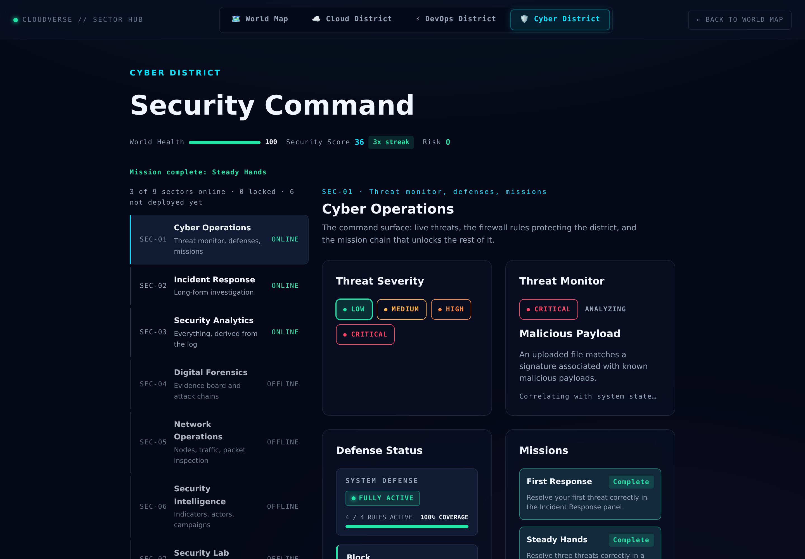
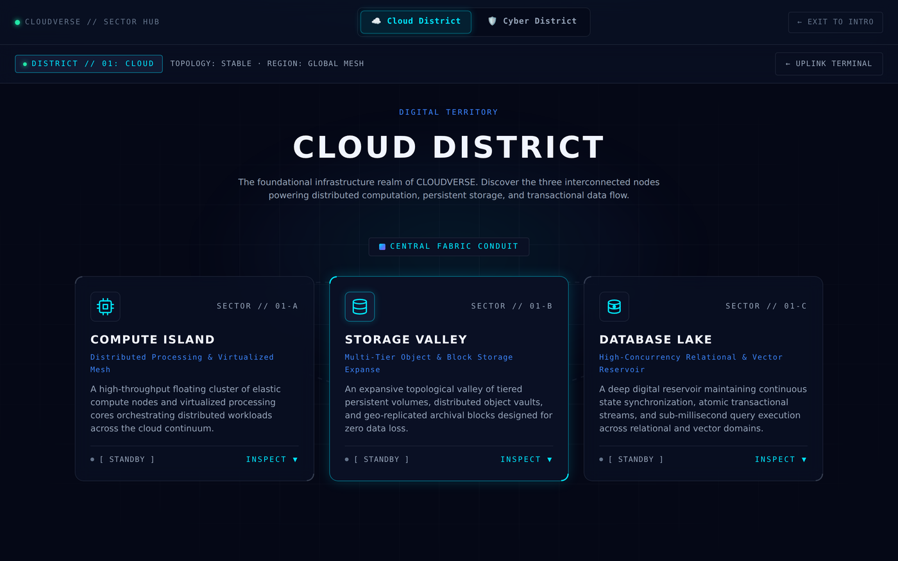
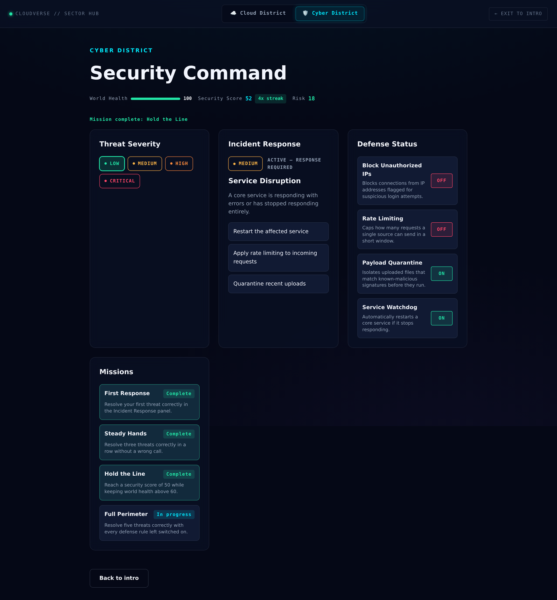
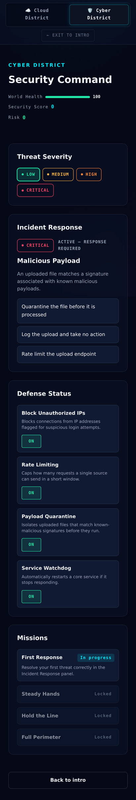
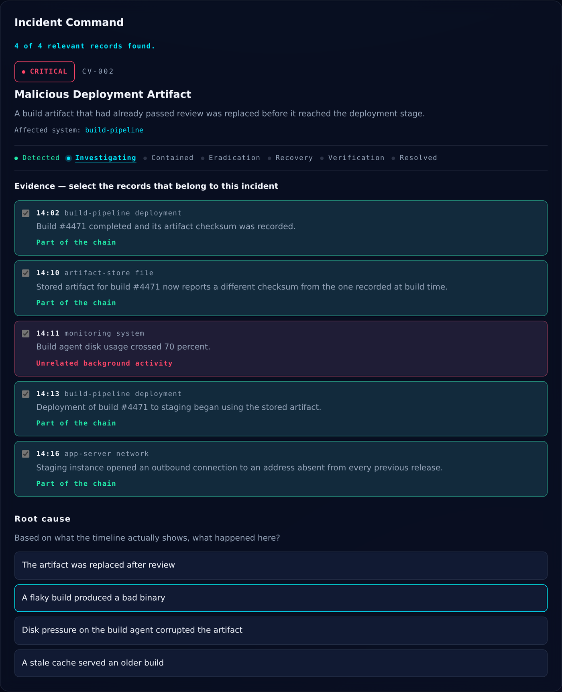
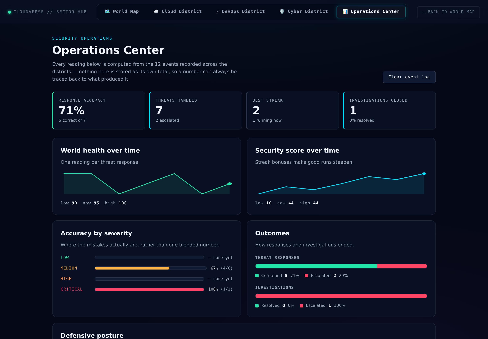

# 🌌 CLOUDVERSE — Enter the Digital World

An interactive, gamified web experience that turns **Cloud Computing**,
**DevOps** and **Cybersecurity** concepts into a world you explore rather
than a dashboard you read.

[](https://github.com/nilushamadhuwanthi123/cloudverse-cyber-world/actions/workflows/ci.yml)

> **Status: in development.** All three districts are playable — Cyber,
> Cloud and DevOps — over a shared game layer, persistence and test
> suite. The world map and the central Core are what remain.



## The loop

CLOUDVERSE is a simulation, not a dashboard, and the difference is that
nothing here is only a readout — every panel is somewhere a decision gets
made and paid for:

```
explore → something happens → you respond → the world changes
    ↑                                              │
    └──────────  progress unlocks more  ←──────────┘
```

A threat appears because the district is in the state it is in. You
answer it, right or wrong, and world health, security score and risk all
move. Missions unlock from what you actually did, and the whole thing
survives a refresh — so the run is yours, not a demo that resets.

## Concept

Three districts surround a central Core:

```
                    ☁ CLOUD
                       │
                       │
          🛡 CYBER ─── 🔷 CORE ─── ⚙ DEVOPS
```

| District | Represents |
|---|---|
| ☁ **Cloud** | Compute, storage, databases |
| ⚙ **DevOps** | CI/CD, build, test, deploy, rollback |
| 🛡 **Cyber** | Threat detection, firewall, incident response |
| 🔷 **Core** | Overall world health and system state |

Actions in a district change world health and security score, which the
Core visualises — so the districts are one system, not three dashboards
sharing a page.

## What's built

**Cyber District** — organised as nine named sectors rather than one long
page, entered through a short startup sequence. Three ship today: Cyber
Operations, Incident Response (which one correct threat response opens)
and Security Analytics. The other six are named, described and honestly
marked as not deployed yet — a rail that called them "locked" would be
telling the player to keep playing for something no amount of play will
deliver. See [`docs/CYBER_SECTORS.md`](docs/CYBER_SECTORS.md).

The rail in the screenshot above says what it means. `LOCKED` is
something you earn — Incident Response opens on the first correct threat
response. `OFFLINE` is something that does not exist yet, and no amount
of play will change that. Collapsing the two into one word is the kind of
small dishonesty that makes a whole interface untrustworthy.

Inside Cyber Operations, a threat runs a Detected → Analyzing → Active
lifecycle, and the player picks one of three defense actions. The right
one restores world health, a wrong one escalates, and every action
carries an explanation, so a wrong answer still teaches. Threat
generation is system-state based rather than pure random: a district
already under strain sees proportionally more of its severe threats.
Alongside it, a firewall panel where switching a rule off starts a slow
health drain for as long as it stays off, and a mission chain that
unlocks in order and survives a page refresh.

**Cloud District** — compute, storage and database locations rendered as
an explorable environment, each able to raise a simulated incident whose
response moves world health.



**DevOps District** — a six-stage delivery pipeline (code → build → test
→ package → deploy → live), each stage opening its own detail view, with
scenario drills that push a failure through it.

### One frame, every system reacting



That is one screenshot, not a composite, and most of what the project
does is visible in it:

- **Security Score 52 with a `4x streak`** — four correct responses in a
  row, each worth more than the last, because steady judgement should
  beat a lucky guess between mistakes.
- **Risk 18, amber** — two firewall rules were switched off moments
  before. Risk is derived from present exposure, so it moved the instant
  they did, and it will drop the instant they go back on.
- **Two rules showing `OFF` in red** while world health quietly drains
  for as long as they stay that way.
- **Missions: three complete, one in progress** — an unlock chain, not a
  checklist. *Full Perimeter* is still open because it asks for five
  correct responses **with every defense on**, and two are off.
- **`Mission complete: Hold the Line`** announced in a live region, so
  the change is heard as well as seen.

Nothing there is a static mock: each panel is reading shared district
state that the others are changing.

<details>
<summary>The same district at 390px</summary>



</details>

**Incident Command** — the Cyber district's long-form investigation. A
case opens, you read a timeline of evidence and pick out the records that
belong to the attack chain, name a root cause, and choose a containment
action knowing it costs something: isolating a server ends the exposure
and takes the service off the air with it. The stages are gated on
purpose — containment options do not appear until a root cause is named,
because choosing a response before you know what happened is the mistake
the exercise exists to prevent. See
[`docs/INCIDENT_RESPONSE.md`](docs/INCIDENT_RESPONSE.md).



The evidence above has been submitted, so each record now carries its
verdict. Four belong to the attack chain — a build finishing, its stored
checksum changing, the deployment picking up the stored copy, and the new
outbound connection that followed. One is ordinary background noise a
running system produces at the same time, and selecting it is marked as
such. No single line proves anything; the order does.

**Operations Center** — a fifth screen that answers "how am I actually
doing" from the record rather than from a scoreboard. Every district
writes what happened to an append-only security event log; this screen
derives all of it back out — response accuracy overall and broken down by
severity, world health and security score plotted over the run, how
investigations ended, and how exposed the defenses ever got. Nothing is
stored as its own total, so any number on the screen can be traced to the
events that produced it, and a chart nobody thought of when the log was
written can still be built from history that already exists. The charts
are hand-written SVG — no charting dependency — and each ships as both a
picture and a screen-reader table, because a line with an `aria-label`
alone tells a non-sighted reader the shape and withholds the numbers. See
[`docs/SECURITY_ANALYTICS.md`](docs/SECURITY_ANALYTICS.md).



Escalation is a real outcome here, not a failure state. The lifecycle
engine had always allowed handing a case to tier 2 from any stage, and
nothing in the UI reached that transition until this screen needed
somewhere to count it — a responder who cannot tell when a case is beyond
them is a worse responder, so the button exists and the log records it as
its own outcome rather than as a loss.

**The layer underneath all three** — `game/` holds the rules (threat
lifecycle, severity, security score with a streak bonus, mission unlock
order, and a risk reading derived from current exposure rather than
accumulated). `services/` is the async seam over `storage/`, so no
component reaches for `localStorage` itself and progress survives a
refresh — including when storage is unavailable, out of quota, or holds
JSON an older build wrote.

**Quality** — 286 tests across the rule, service, storage, navigation
and chart layers; lint, tests and build run on every pull request; zero axe-core
accessibility violations on all five screens, verified in a real browser
rather than by eye. See [`docs/TESTING.md`](docs/TESTING.md) and
[`docs/ACCESSIBILITY.md`](docs/ACCESSIBILITY.md) for what was measured
and why the coverage line sits where it does.

## Decisions worth explaining

A few choices here were deliberate, and the reasoning is the interesting
part:

**Risk is derived, not accumulated.** World health and security score are
records of what already happened. Risk is a reading of the district's
condition *right now*, so it is recomputed from current state rather than
added up. Switching a defense back on drops risk immediately — a running
total could never do that, and the difference is what makes risk feel
like a gauge instead of another score.

**Threat generation reads system state.** A purely random threat feed
would make the district a slot machine. Instead, low world health both
raises the chance of a threat and skews *which* threat: a district under
strain sees proportionally more of its severe types, so the simulation
reacts to its own condition.

**A wrong answer still teaches.** Every defense action carries an
explanation, correct or not, because the point is to learn why a response
fits — not to be scored and moved along.

**Rules live outside React.** `game/` holds no JSX, no DOM and no
`localStorage`, which is why 77 tests can cover the interesting behaviour
as plain function-in, value-out. The failures worth catching in a project
like this are rule failures — a mission unlocking out of order, a streak
bonus that keeps paying after a mistake — and those are cheapest to test
when the rules do not need a browser.

**The services seam is not decoration.** Every read and write goes
through `services/`, whose functions are async even though nothing they
do needs to be yet. The day they become `fetch()` calls, their signatures
do not change and no component is rewritten. That single restriction —
components never import `data/` or `storage/` directly — is what makes
the "API-ready" claim in this file checkable rather than a slogan.

**Storage failure is a normal case.** A browser in privacy mode throws on
`localStorage` access itself, not just on write. So the adapter treats
unavailable storage, exhausted quota and JSON an older build wrote as
ordinary paths that degrade to a fresh, fully playable session — and
`reset` clears only the keys this app owns, never the whole origin.

## Tech stack

React 19 · Vite · JavaScript (JSX) · CSS3 · SVG · anime.js · localStorage

No TypeScript, Redux, Three.js, backend, or paid services — by design.
The architecture is meant to stay readable, and every dependency has to
earn its place.

> **Note on anime.js:** this project uses **v4**, whose API differs from
> the v3 examples found in most tutorials (`import { animate } from
> 'animejs'`, not a default `anime()` call).

## Architecture

Layered, with a deliberate seam between the UI and where data comes from:

```
UI → Components → Application Logic → Data Layer → Persistence
```

The app is client-side today and says so honestly. It is *API-ready*
because every read and write already goes through `src/services/`, so
swapping those for `fetch()` calls would not require rewriting the UI.

See [`docs/ARCHITECTURE.md`](docs/ARCHITECTURE.md) for the full
reasoning, including where state lives and why.

## Project structure

```
src/
├── features/
│   ├── cyber/      sector rail, boot sequence, threat panel, defenses, missions
│   ├── cloud/      compute, storage and database locations
│   ├── devops/     the delivery pipeline and its scenario drills
│   ├── analytics/  the Operations Center and its SVG charts
│   └── intro/      the entry sequence
├── game/           the rules — framework-free, no JSX or DOM
│   ├── threatEngine.js       lifecycle, generation, response resolution
│   ├── threatTypes.js        threat catalogue and severity
│   ├── defenseRules.js       firewall rule catalogue
│   ├── securityScore.js      scoring and streak bonus
│   ├── riskScore.js          current exposure, derived
│   ├── missionState.js       unlock order and completion
│   ├── cyberNavigation.js    which sectors are open, locked or unbuilt
│   ├── incidentResponse.js   investigation lifecycle
│   ├── securityEvents.js     the append-only event log
│   └── securityAnalytics.js  every reading, derived from that log
├── data/           content: missions, incident cases, sector catalogue
├── services/       the async seam over storage
├── storage/        localStorage adapter
├── styles/         design tokens and global styles
└── lib/            motion helper over anime.js, chart geometry
```

`app/` and `components/` exist as placeholders with a README each; the
central Core is not built yet. Every folder carries a
short `README.md` explaining what belongs in it — useful when two people
are adding files to the same tree.

## Running locally

```bash
git clone https://github.com/nilushamadhuwanthi123/cloudverse-cyber-world.git
cd cloudverse-cyber-world
npm install
npm run dev
```

| Command | Does |
|---|---|
| `npm run dev` | Start the dev server |
| `npm run build` | Production build into `dist/` |
| `npm run preview` | Serve the production build locally |
| `npm run lint` | Lint the source |
| `npm test` | Run the test suite once |
| `npm run test:watch` | Run the tests in watch mode |

## Collaboration

Built by two developers working in parallel:

| Developer | Area |
|---|---|
| **Nilusha Madhuwanthi** | Cybersecurity district, and the shared `game/` · `services/` · `storage/` · `data/` layers underneath both districts |
| **Kavindu Maduhansa** | Cloud district, DevOps district, world map |

Work happens on feature branches and merges through pull requests the
other developer reviews. Districts live in separate folders so the two
streams rarely touch the same files; where they do meet — `game/`,
`styles/`, the app shell — a real review matters.

The reviews are real ones. The Cloud district PR was sent back with four
findings before it merged: a duplicate `<main>` landmark that broke the
skip link, two labels at 3.96:1 against a 4.5:1 minimum, a CSS header
comment that claimed something the file did not do, and — the one that
mattered — a merge resolution that had quietly dropped the district's
route, so the feature was on the branch but unreachable in the app. Each
was verified fixed in a browser before approval.

## Roadmap

| Phase | State |
|---|---|
| Setup · Visual foundation · Intro | done |
| Cyber district | done |
| Cloud district | done |
| DevOps district | done |
| Incident response · Digital forensics | done — lifecycle, evidence correlation, containment trade-offs |
| Game mechanics · Unlocks | done — scoring, missions, unlock order |
| Responsive · Accessibility & performance | done — zero axe violations on all three districts |
| Testing | done — 158 tests, CI on every PR |
| Production build · Deployment | done — published to GitHub Pages on every push to main |
| Documentation | architecture, testing, accessibility and incident-response docs |
| World map | next — a district switcher stands in for now |
| Event engine · Core | not started |

## Disclaimer

CLOUDVERSE is an **educational simulation** of digital infrastructure and
cybersecurity concepts. It does not perform real-world attacks,
penetration testing, network scanning, or real cloud infrastructure
operations. Every threat, incident and system in the application is
fictional data defined inside this repository.
