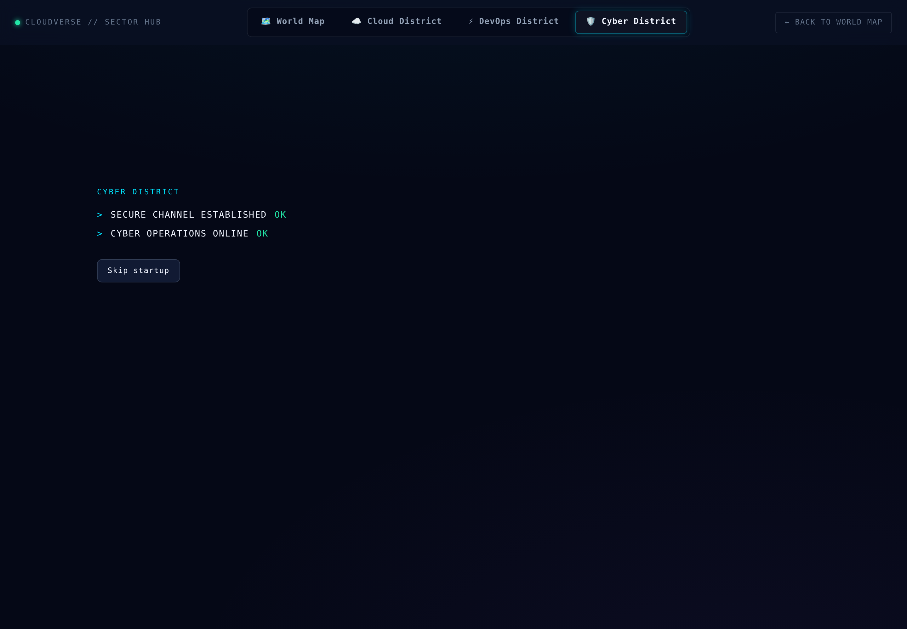

# Cyber District sectors

The Cyber District is organised as nine named sectors rather than one
long scrolling page. This note explains how that navigation is put
together and, more importantly, what it refuses to pretend.


## Three states, not two

A sector is in exactly one of three states, and the distinction matters:

| State | Means | Shown as |
|---|---|---|
| `online` | Built, and open right now | `ONLINE` |
| `locked` | Built, but not earned yet | `LOCKED` |
| `planned` | Named here, not built yet | `OFFLINE` |

Most navigation systems collapse the last two into "locked". That is a
lie: it tells the player to keep playing for something no amount of play
will deliver. `Cyber Arcade` is not something you unlock in this build —
it is something that does not exist yet, and the rail says so.

What exists is content, in [`src/data/cyberSectors.js`](../src/data/cyberSectors.js).
What is reachable right now is a function of live progress, in
[`src/game/cyberNavigation.js`](../src/game/cyberNavigation.js). Keeping
those apart means the rail's states can be asserted as plain values:

```js
const sectors = resolveSectors({ completedMissionIds: [] })
sectors.find((s) => s.id === 'incident-response').state // 'locked'
sectors.find((s) => s.id === 'arcade').state            // 'planned'
```

## What ships today

- **SEC-01 Cyber Operations** — open. Threat monitor, defense rules,
  severity, missions.
- **SEC-02 Incident Response** — gated behind the `first-response`
  mission. One correct threat response opens the case file, which is a
  low bar deliberately: the gate exists to teach that the district has an
  unlock system, not to hold anything back.
- **SEC-03 Security Analytics** — open, and moved inside Cyber where it
  belongs. It was briefly a fifth top-level tab, which put an analytics
  screen at the same level as the districts it analyses.
- **SEC-04 to SEC-09** — Digital Forensics, Network Operations, Security
  Intelligence, Security Lab, Cyber Academy and Cyber Arcade are named,
  described, and honestly marked as not deployed.

The district header states the split out loud — "3 of 9 sectors online ·
0 locked · 6 not deployed yet" — because a rail of nine where six are
unavailable reads as a broken build until it explains itself.

## Selecting an unavailable sector

Locked and offline sectors stay in the rail, stay focusable, and stay
selectable. Choosing one shows what it is, what it will contain, and
either what opens it or that it is not built yet.

They deliberately carry **no** `aria-disabled`. That attribute promises a
control that does nothing, and these do something useful. The state
reaches assistive technology through the `ONLINE` / `LOCKED` / `OFFLINE`
word inside the tab, which is part of its accessible name — never through
colour alone.

`landingSector()` follows the same principle: it keeps whatever sector
was asked for as long as this build has it, and falls back only for an id
that does not exist at all. An earlier version bounced any unavailable
sector back to Operations, which made every click on a locked row look
like a dead control.

## Keyboard

The rail is a real `tablist` with the behaviour the pattern promises:

- Arrow keys move between sectors and wrap at both ends
- `Home` and `End` jump to the first and last
- Roving tabindex — only the selected tab is in the tab order, so `Tab`
  leaves the rail instead of walking through nine items to reach the
  content the rail controls
- Each tab is `aria-controls` its panel; the panel is `aria-labelledby`
  its tab and takes focus with a visible ring

## Entry sequence



Entering the district plays four lines — secure channel, operations
online, threat monitor, defense sync — and then reveals the interface.
It is theatre, and theatre that blocks the interface has to be honest:

- The **Skip** button is focused first, so nobody is held there
- `prefers-reduced-motion` skips it outright rather than playing it
  faster; someone who asked for less motion asked for less of this, not
  a brisker version of it
- The lines are one polite live region, announced as they arrive rather
  than as four separate interruptions
- Timers are cleared on unmount, so leaving mid-sequence cannot call back
  into a component that is gone

## Heading structure

One `h1` per screen (`Security Command`), the sector name as `h2`, panel
headings as `h3`, and sub-headings inside a panel as `h4`. Verified with
axe-core in a real browser: 0 violations on every sector.
