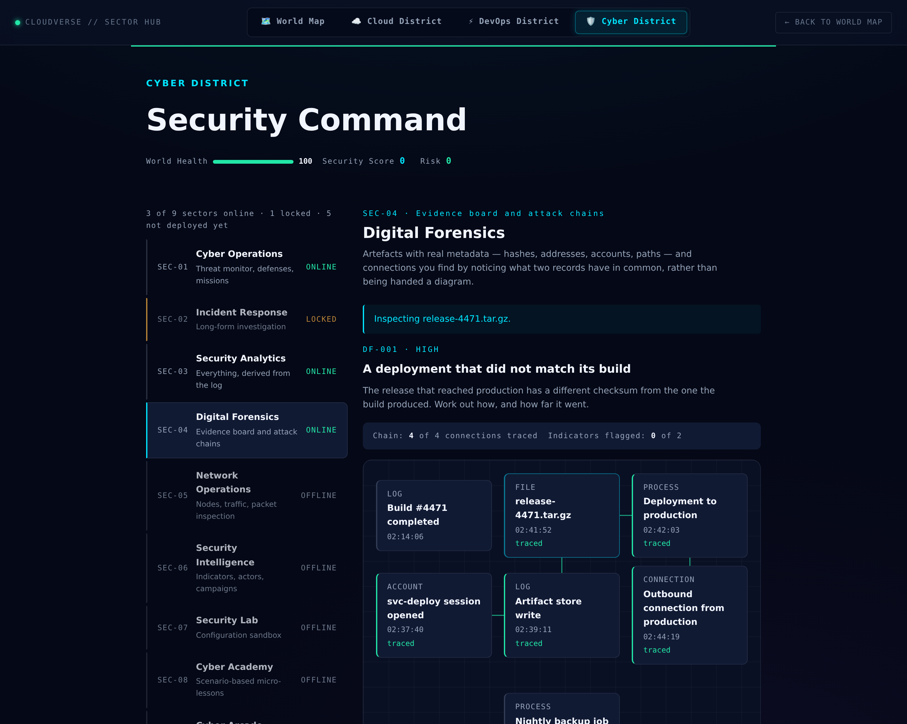

# Digital Forensics

The idea the whole sector rests on: **a connection between two artefacts
is not authored, it is derived from what they have in common.**

## No edge list

`data/forensicCases.js` contains records. It contains no list of which
records are connected. Two artefacts are linked when they share an
indicator — the same address, account, hash or object — and
`game/forensics.js` works that out:

```js
sharedIndicators(session, storeWrite)
// ['account:svc-deploy', 'ip:198.51.100.23']
```

Two consequences, and both are the point:

1. **The picture cannot disagree with the evidence.** A hand-written
   edge list can draw a line the records do not support, and "the
   diagram says these are linked but the data does not" is precisely the
   bug a forensics exercise must not contain.
2. **It is the skill being practised.** A responder is not handed a
   diagram. They are handed records, and the diagram is what they build
   by noticing that two of them mention the same address.

`traceConnection()` returns the shared indicators rather than a boolean,
because "these are connected" is not the useful answer — *what* connects
them is.

## Refusing a trace is a finding

Attempting to connect two unrelated records does not fail silently:

> svc-deploy session opened and Nightly backup job share no address,
> account, object or hash. That is a finding in itself.

Every case includes at least one artefact that connects to nothing —
the nightly backup, the routine config push. A timeline with nothing
innocent in it is not an exercise; telling ordinary activity from the
chain is the whole job. A test enforces that each case has one.

A supported connection *away* from the chain is reported separately
rather than penalised. Counting a real observation against the player
teaches them to stop looking.

## The drawing is the bonus, not the truth



Every artefact is a real button. Every traced connection is written out
in words underneath the board — *"Artifact store write ↔
release-4471.tar.gz — shares account:svc-deploy,
artifact:release-4471.tar.gz"*. The SVG that joins them is
`aria-hidden`, because it repeats information that is already there in
text.

Below 900px the positioning is dropped entirely and the same board reads
as a plain list. Nothing is lost in that change, because nothing was
ever only in the picture.

## Two bugs the browser found

**Cards were swallowing each other's clicks.** Artefacts are positioned
by percentage, and the coordinates were chosen by eye. Measured in a real
browser, the board rendered 320px wide while each card is 184px — 57% of
the board — so cards overlapped and the one on top intercepted pointer
events meant for the one beneath. The board now takes the full width of
the sector stage (598px measured), and a test asserts every pair of
coordinates clears the card's real footprint.

**A grid item that refused to shrink.** On a 400px screen the sector rail
rendered 2192px wide and dragged the whole document into horizontal
scroll. A grid item's default `min-width` is `auto`, so a rail that is
meant to scroll *inside itself* could not be narrower than its widest
row. `min-width: 0` on the rail and on the district nav's tab row; body
`scrollWidth` now matches `clientWidth` exactly on every screen.

## Scope

Every host, address, hash, path and account is invented. Addresses come
from the ranges reserved for documentation — 192.0.2.0/24,
198.51.100.0/24, 203.0.113.0/24 — so nothing here can point at a real
machine even by accident, and a test enforces it. Nothing describes a
real attack technique or tool.
