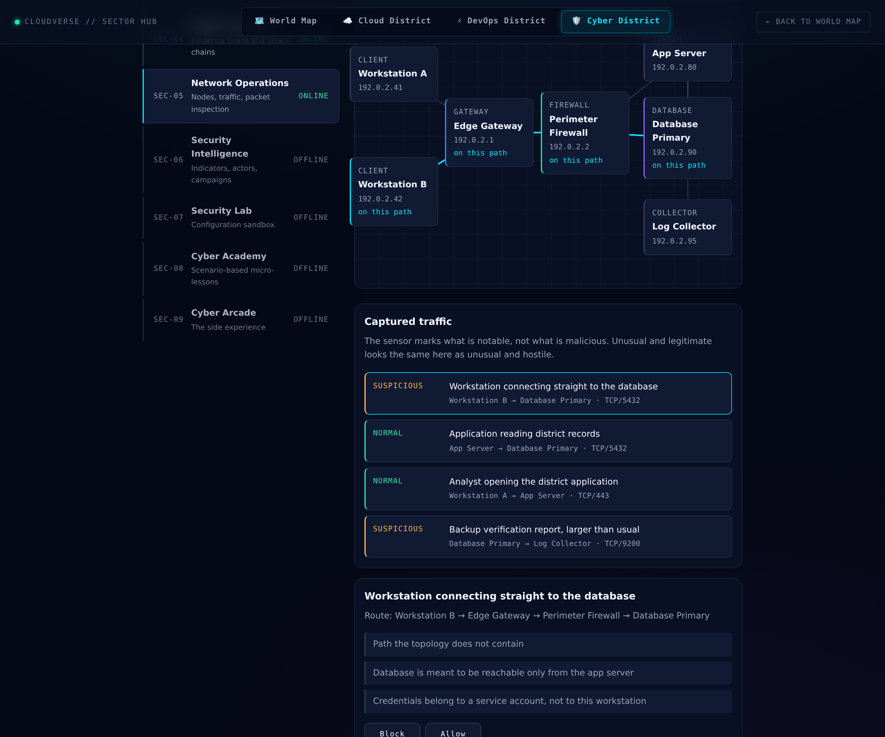

# Network Operations

Two ideas carry this sector, and both are about judgement rather than
spectacle.

## The network reads the same world everything else reads

`threatPressure()` is a single number derived from world health and the
current perimeter:

```js
threatPressure({ worldHealth: 100, ruleStates: allOn })  // 0.12
threatPressure({ worldHealth: 40,  ruleStates: allOff }) // 0.66
```

It decides how likely the next captured packet is to be malicious. A
healthy district with all four defense rules on sees mostly ordinary
traffic; one that is bleeding health with its perimeter open sees a lot
more that is worth stopping. The reading is shown on screen — *"Threat
pressure: 13% from world health 97 and the current perimeter"* — so the
connection is visible rather than asserted.

Both ends are clamped. A perfectly healthy district still sees the
occasional bad packet, and a collapsing one is never certain to.

## A false positive costs something



Four outcomes, not two:

| | Blocked | Allowed |
|---|---|---|
| **Malicious** | contained, **+3** health | missed, **−8** health |
| **Legitimate** | outage you caused, **−3** health | working normally, **0** |

Missing a threat costs much more than catching one earns, which is
right. But blocking working traffic costs too, and that is the part most
exercises leave out. A model where blocking is free teaches the player to
block everything, which is the opposite of the judgement the sector is
for.

To make that real, the queue includes **legitimate traffic that looks
odd** — a backup verification report six times its usual size, outside
its usual window. The sensor marks it `SUSPICIOUS`, because that is what
a sensor does. Its four signals are all true and none of them is
malicious: the account is the scheduled backup account, and the
destination is the collector rather than an external address. Blocking it
is an outage, and the explanation says so:

> Unusual is not the same as malicious, and this outage is one you
> caused.

A test enforces that at least one legitimate pattern carries a
`looksOdd`. A queue where everything unusual turns out to be hostile
teaches the wrong lesson.

## The bug the screenshot caught

Packets originally carried `offPath: !isLinked(from, to)` — true whenever
the two endpoints were not *directly* linked. The inspector printed *"a
path the topology does not contain"*, and the screenshot showed it saying
that about the **legitimate** backup report.

The model was wrong. A workstation reaching the app server crosses the
gateway and the firewall on the way; that is not a bypass, it is exactly
how the network is meant to work. The field was marking ordinary traffic
as though it had gone around the perimeter — a reason to block it that
the evidence did not support.

`routeBetween()` replaces it: a breadth-first walk of the topology
returning the actual hops. The inspector now shows the route —
*"Route: Workstation B → Edge Gateway → Perimeter Firewall → Database
Primary"* — and the map lights every node along it rather than just the
two ends. Where a route genuinely does not exist, it says so. The
malicious database connection makes its case through its own signals,
which is where a policy violation belongs: the database is meant to be
reachable only from the app server, and no topology walk can know that.

## Where the decisions go

Each decision writes a `network-decision` event carrying what the packet
actually was, so the log can tell a missed threat from a false positive
after the fact. A single `correct` flag could not — both are wrong, and
wrong in opposite directions with different fixes.

The Security Event Feed names all four outcomes separately, and world
health moves by the table above, which feeds straight back into the
threat pressure that decides what arrives next.

## Scope

Every host, address and service is invented. Addresses come from the
ranges reserved for documentation (RFC 5737), and a test enforces it.
Nothing here describes a real attack technique or tool.
